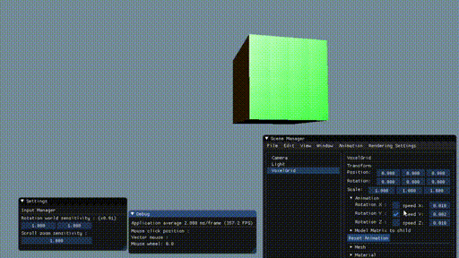

# Voxel-Engine

[](https://travis-ci.com/TheSpyGeek/VoxelEngine)

Green-engine is a graphic engine from a student to learn how we create a graphical engine.



#### Features

###### Add 3D Object

Object can be added in the menu ```Edit```

* Add Mesh Object from ```.OFF``` file
* Add a plane
* Add a sphere
* Add a terrain modified with ```Perlin``` noise

###### Change transform

* change position
* change orientation
* change scale
* animate orientation

###### Change tools position

* change camera position, fov, orientation
* change light position

###### Display

* Activate/Desactivate the display in wire frame


#### How to clone

```git clone --recursive https://github.com/TheSpyGeek/ImGUITemplate.git```

#### Build

##### On Linux

Dependencies :

```sudo apt-get install -y build-essential cmake xorg-dev libgl1-mesa-dev libfreetype6-dev```

To build :

```mkdir build && cd build && cmake .. && make```

##### On Windows

Dependencies :

* [Mingw](https://sourceforge.net/projects/mingw-w64/)
* [Cmake](https://cmake.org/download/)

To build :

* Create a directory ```build```
* Run ```Cmake```
* Configure with ```Mingw Makefile```
* Run ```mingw64```
* Go to ```build``` directory
* Compile with ```mingw32-make```

#### Ressources

* https://sonarlearning.co.uk/coursepage.php?topic=game&course=ext-bb-3d-ged
* https://www.3dgep.com/courses/
* https://github.com/nothings/stb
* https://jheer.github.io/barnes-hut/
* https://www.youtube.com/watch?v=BP6NxVxDQIs