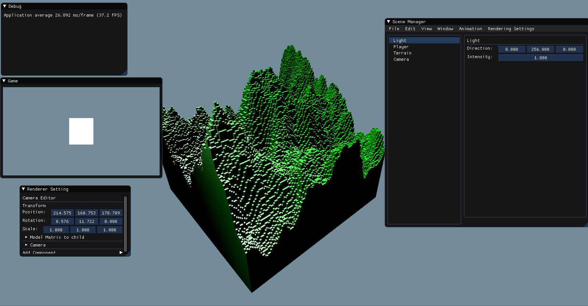

# Voxel-Engine

[](https://travis-ci.com/TheSpyGeek/VoxelEngine)

Voxel-Engine is a WIP game engine specialized for voxel rendering. It is made by 2 students to learn the process of creating a game engine.



#### Features

###### Jeu

* you can shoot projectile by pushing F

###### Change transform

* Change position
* Change orientation
* Change scale
* Animate orientation

###### Change tools position

* Change camera position, fov, orientation
* Change light position

###### Display

* Activate/Deactivate display in wire frame

###### Components 

The components are in the folder ```src/components/```

* Camera Follow : follow the objet attached to
* Axis Renderer : display axis in the camera Editor
* Camera Controller First Person : allow to move and rotate the camera with left and right click
* Camera Projective : functions needed to make a projective camera
* Camera Renderer : WIP, display the camera in the editor
* Chunk Renderer : display a terrain composed of chunks with OpenGL
* Controller : allow to interactively strafe and go forward and backward
* Mesh Renderer : display in the screen with OpenGL the mesh
* Third Person Controller : allow to move the camera around an objet like in a third person game

#### How to clone

```git clone --recursive https://github.com/TheSpyGeek/VoxelEngine.git```

#### Build

##### On Linux

Dependencies :

```sudo apt-get install -y build-essential cmake xorg-dev libgl1-mesa-dev libfreetype6-dev```

To build :

```mkdir build && cd build && cmake .. && make```

##### On Windows

Dependencies :

* [Mingw](https://sourceforge.net/projects/mingw-w64/)
* [Cmake](https://cmake.org/download/)

To build :

* Create a directory ```build```
* Run ```Cmake```
* Configure with ```Mingw Makefile```
* Run ```mingw64```
* Go to ```build``` directory
* Compile with ```mingw32-make```

##### On MAC OSX

Should work

#### Resources

* https://sonarlearning.co.uk/coursepage.php?topic=game&course=ext-bb-3d-ged
* https://www.3dgep.com/courses/
* https://github.com/nothings/stb
* https://jheer.github.io/barnes-hut/
* https://www.youtube.com/watch?v=BP6NxVxDQIs
* Let's make a voxel engine : https://sites.google.com/site/letsmakeavoxelengine/home/
* https://community.khronos.org/t/how-to-draw-one-line-on-top-of-another-in-opengl-without-z-fighting/68922
* Free look camera : https://gamedev.stackexchange.com/questions/60266/create-a-fly-camera-with-lookat
* Third person camera : https://www.youtube.com/watch?v=PoxDDZmctnU&list=PLRIWtICgwaX0u7Rf9zkZhLoLuZVfUksDP&index=19
* Voxelizer sur blender : https://www.youtube.com/watch?v=ntVhi8SlOzA
* Voxelizer algorithm : https://github.com/davidstutz/mesh-voxelization
* Travis Windows build : https://github.com/open-license-manager/open-license-manager/blob/dfddf5294677407c3a01b3a13c8348f02fe993ee/.travis.yml
* FBX loader : https://github.com/nem0/OpenFBX/blob/master/demo/main.cpp#L203
* Procedural generation : https://www.youtube.com/watch?v=wbpMiKiSKm8
* Multi-threading : https://www.randygaul.net/wp-content/uploads/2014/09/MultiThread.pdf

